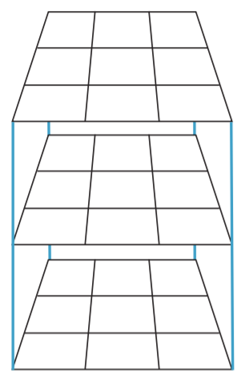

# CS224-Project - 3D Tic Tac Toe #

# Language #
Python 2

# Dependencies #
* pygame
* OpenGL - (PyOpenGl)

Use `python -m pip install <dependency>`

# Usage #
* Use `python driver2D.py` to play the game with 2d graphics
* Use `python drivercli.py <cpu> <size>` to play the game in the command line
     * <cpu>  : (optional) set equal to 'cpu' if you want to play against a CPU player : default is aginst human player
     * <size> : (optional) size to make the game board : default is 3

# Content #
* __Documents__
     * CS224 Presentation.pdf - ppt slides
     * CS224 Semester Project.docx - word doc write up
* __images__
     * 8_bit_racer.png - img for testing.py
     * gamebboard.png - img for 3d tic tac toe graphics
* __tool_testing__
     * code testing libraries
     * testing.py - little doging game in pygame - req pygame - [tutorial](https://www.youtube.com/watch?v=ujOTNg17LjI&list=PLQVvvaa0QuDdLkP8MrOXLe_rKuf6r80KO)
* ~~3dtesting.py~~ - TODO delete ?
* ~~board.py~~ - very basic simulation of 3d tik tac toe - no win checking - obsolete
* __bot.py__ - contains code for bot(s)
* __driver2D.py__ - 3d tic tac toe with 2d Graphics
* __drivercli.py__ - 3d tic tac toe in the command line
* __game.py__ - game logic in class with some win checking
